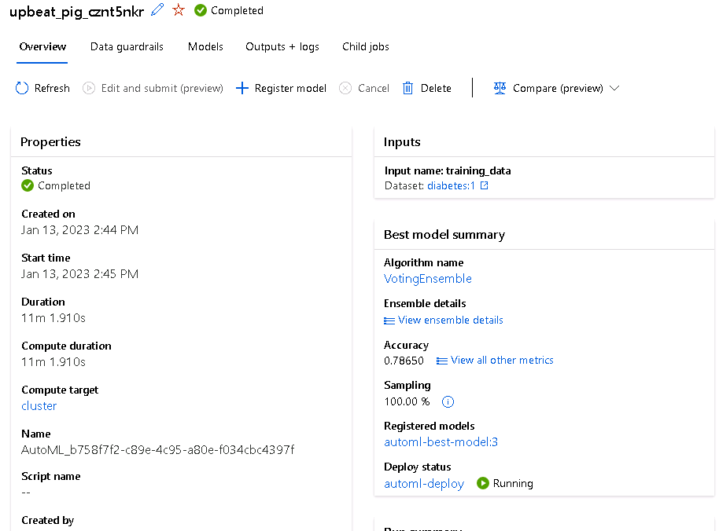
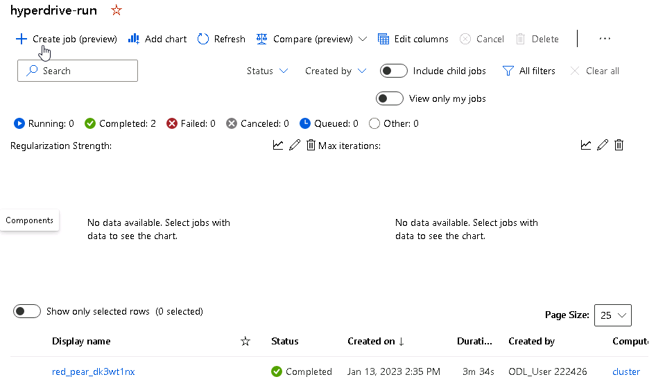
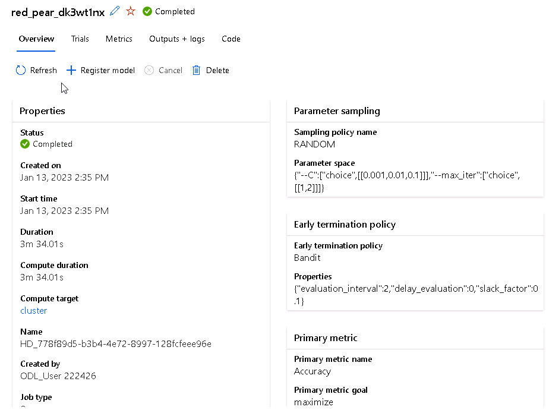
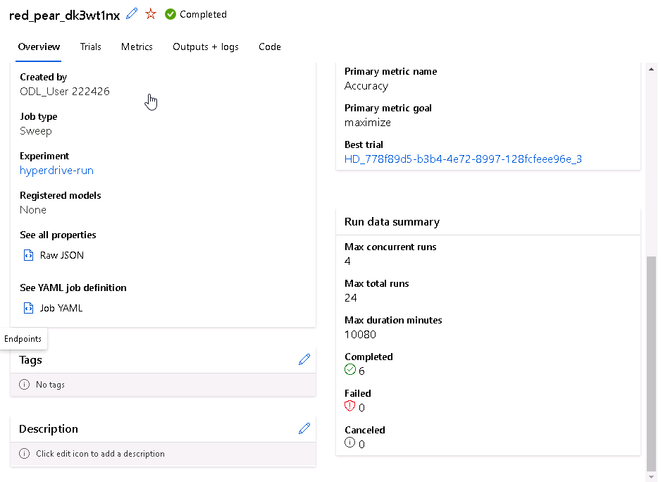
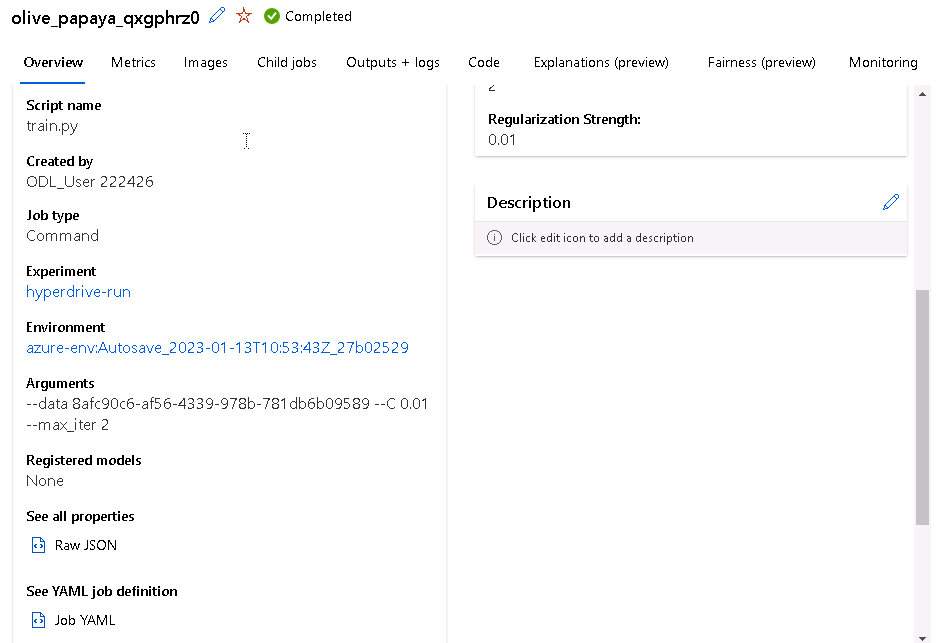

# Capstone Project Azure Machine Learning Engineer

This project gives me the opportunity to use the learned knowledge from the Udacity Nanodegree "Azure Machine Learning Engineer with Microsoft Azure" to solve an interesting problem. In this project, I will create two models: one using Automated ML (denoted as AutoML from now on) and one customized model whose hyperparameters are tuned using HyperDrive. I will then compare the performance of both models and deploy the best performing model.

This project will demonstrate my ability to use an external dataset in my workspace, train a model using the different tools available in the AzureML framework as well as my ability to deploy the model as a web service.

## Project Set Up and Installation
The following steps were performed to setup this project and prepare the models, the pipeline, the deployment and to consume it in the end:

1. Create a new Compute Instance or use an existing one provided in the Lab.

2. Create a CPU Compute Cluster to train the model.

3. Upload an external dataset to Azure Machine Learning Workspace to use it for training a model.

4. Upload the required notebooks to create AutoML and Hyperparameter Model.

5. Create AutoML experiment using the 'automl.ipynb' notebook.

6. Create the HyperDrive experiment using the 'hyperparameter_tuning.ipynb' notebook.

7. Select the best model.

8. Deploy the best model as a web service.

9. Enable the application insights and service logs.

10. Test the endpoint by sending a sample json payload and receive a response. 

## Dataset
This dataset is originally from the National Institute of Diabetes and Digestive and Kidney Diseases. The objective of the dataset is to diagnostically predict whether or not a patient has diabetes, based on certain diagnostic measurements included in the dataset. Several constraints were placed on the selection of these instances from a larger database. In particular, all patients here are females at least 21 years old of Pima Indian heritage.

(https://www.kaggle.com/uciml/pima-indians-diabetes-database)

This dataset consists of several medical predictor variables and one target variable, Outcome. Predictor variables includes the number of pregnancies the patient has had, their BMI, insulin level, age, and so on. More details are shown in the following screenshot:

### Overview
In this project, we will be using Azure Machine Learning Studio to create a model and it's pipeline and then deploy the best model and consume it. We will be using two approaches in this project to create a model:

- Using Azure AutoML
- Using Azure HyperDrive

And the best model from any of the above methods will be deployed and then consumed.
We will be using LogisticRegression classifier to train the model and accuracy as a metric to check best model.

### Task
In this project our task is to predict wheather a user is diabetic or not based on features like number of pregnancies the patient has had, their BMI, insulin level, age, and so on and also it values.

### Access
The dataset was taken from kaggle from the link provided in dataset section and then uploaded (registered) in the Azure Machine Learning Studio in Datasets tab through 'upload from local file' option. The dataset was registered with the name 'diabetes'.
The screenshot shows the registered dataset:

## Automated ML
This screenshot shows the trained models:

### Results
The best model from AutoML is the VotingEnsemble model with an accuracy of 78.65 %.

## Hyperparameter Tuning
For Hyperdrive I choose the logistic regression classifier as model, because the target column output is 1 or 0 -> classification problem. The dataset is loaded into the notebook and the script train.py is used for training.

- hyperparameter sampling: randomparametersampling with --C (inverse of regularization) and --maxiter (maximum number of iteraions)
- policy: bandit policy as an eraly stopping policy, bandit polidy ends run if the primary metric is not within the specified slack factor when compared with the highest performing run
- primary metric: accuracy
- primary metric goal: maximize
- max total runs: set to 24
- max concurrent runs: set to 4

### Results
The best model from Hyperdrive is the Vlogistic regression classifier (hyperparameters: C = 0.01, max_iter = 2) with an accuracy of 76.04 %. We can improve it with more hyperparameters, other models, longer training, more data preprocessing, other sampling methods, other metrics ...

## Model Deployment
After training of the two approaches we can see that the accurancy of the autoML model is better than the hyperdrive model. Because of this I choosed the autoML model for deployment. Therefore I decided to register the autoML model as the better model and deployed it as a web service. Also the application insights are enabled for it.

Enable insights via notebook
 
 
Deployed model with insights enabled:
 
 
 
 Consume model:
 
 
 Print logs and delete web service
 

## Screen Recording
The screen recording is uploaded to youtube: https://youtu.be/9lTCwMDG650
